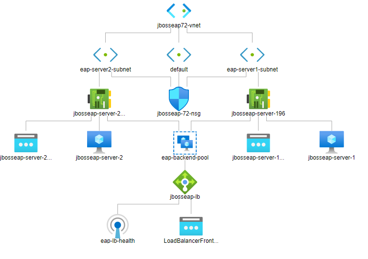

# JBoss EAP 7.2 on RHEL 8.0 on Azure VMSS (clustered, multi-VM)

<a href="https://portal.azure.com/#create/Microsoft.Template/uri/https%3A%2F%2Fraw.githubusercontent.com%2FSpektraSystems%2Fredhat-mw-cloud-quickstart%2Fmaster%2Fjboss-eap-clustered-rhel-VMSS%2Fazuredeploy.json" target="_blank">
    

<!-- TOC -->

1. [Solution Overview ](#solution-overview)
2. [Template Solution Architecture ](#template-solution-architecture)
3. [Licenses and Costs ](#licenses-and-costs)
4. [Prerequisites](#prerequisites)
5. [Deployment Steps](#deployment-steps)
6. [Deployment Time](#deployment-time)
7. [Post Deployment Steps](#post-deployment-steps)

<!-- /TOC -->

## Solution Overview

JBoss EAP is an open source platform for highly transactional, web-scale Java applications. EAP combines the familiar and popular Jakarta EE specifications with the latest technologies, like Microprofile, to modernize your applications from traditional Java EE into the new world of DevOps, cloud, containers, and microservices. EAP includes everything needed to build, run, deploy, and manage enterprise Java applications in a variety of environments, including on-premise, virtual environments, and in private, public, and hybrid clouds.

This template creates two JBoss EAP Instances running inside a VNet and each server is in it’s own subnet. Both the servers are added to the backend pool of a Load Balancer.

## Template Solution Architecture

This template creates all of the compute resources to run EAP 7.2 on top of RHEL 8.0 VMs which are added to the backend pool of a Load Banlancer. Following are the resources deployed:

- 2 RHEL 8.0 VMs
- 1 Load balancer
- Virtual Network with 2 subnets
- EAP 7.2 on RHEL 8.0
- Sample application deployed to JBoss EAP 7

Following is the Architecture :

To learn more about JBoss Enterprise Application Platform, check out:
https://access.redhat.com/documentation/en-us/red_hat_jboss_enterprise_application_platform/7.2/

## Licenses and Costs 

This uses RHEL 8.0 image which is a PAY AS YOU GO image and doesn't require the user to license it, it will be licensed automatically after the instance is launched first time and user will be charged hourly in addition to Microsoft's Linux VM rates.  Click [here](https://azure.microsoft.com/en-gb/pricing/details/virtual-machines/linux/#red-hat) for pricing details.

## Prerequisites

1. Azure Subscription with specified payment method (RHEL 8 is a market place product and requires payment method to be specified in Azure Subscription)

2. To deploy the template, you will need to:

    - Choose an admin user name and password for your VM.  

    - Choose a EAP user name and password to enable the EAP manager UI and deployment method.
    
## Deployment Steps

Build your environment with EAP 7.2 on top of RHEL 8.0 which is added to the backend pool of the Load Balancer on Azure in a few simple steps:  
1. Launch the Template by click on Deploy to Azure button.  
2. Fill in the following parameter values. Then accept the terms and condition before clicking on Purchase.

    - **Subscription** - Choose the right subscription where you would like to deploy.

    - **Resource Group** - Create a new Resource group or you can select an existing one.

    - **Location** - Choose the right location for your deployment.

    - **Admin Username** - User account name for logging into your RHEL VM.

    - **Admin Password** - User account password for logging into your RHEL VM.

    - **EAP Username** - User name for EAP Console.

    - **EAP Password** - User account password for EAP Console.

    - Leave the rest of the Parameter Value as it is and proceed.
    
## Deployment Time 

The deployment takes approx. 10 minutes to complete.

## Post Deployment Steps

- Once the deployment is successfull, go the VM and copy the Public IP of the VM which is the Public IP of the Load Balancer.
- Open a web browser and go to **http://<PUBLIC_HOSTNAME>** and you should see the web page:

- If you want to access the administration console go to **http://<PUBLIC_HOSTNAME>:9990** and enter the EAP Username and Password:

