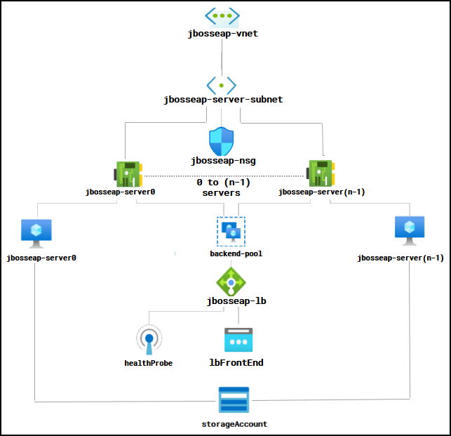
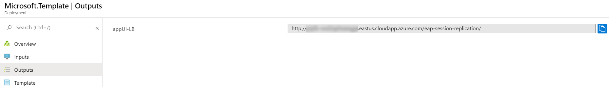
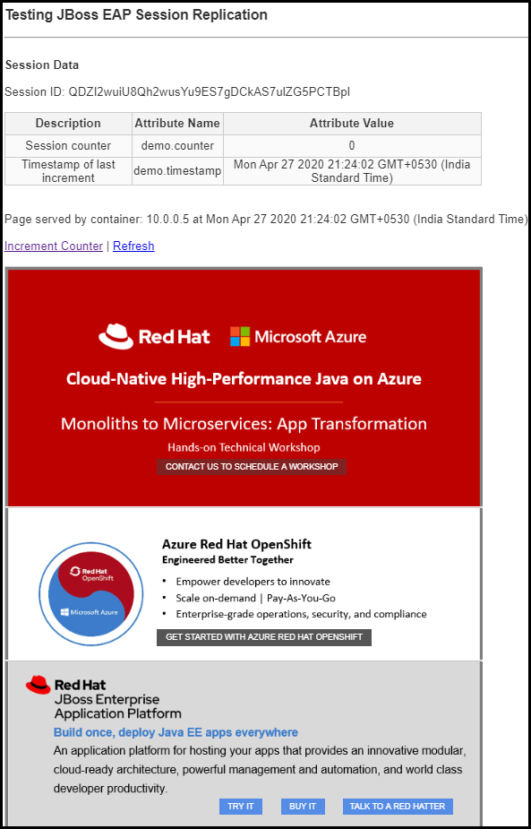
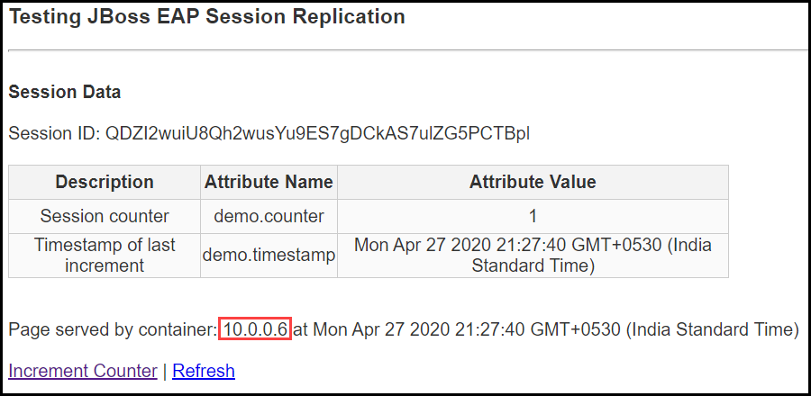

# JBoss EAP 7.2 on RHEL 8.0 (clustered, VMSS)

`Tags: JBoss, Red Hat, EAP 7.2, Cluster, Load Balancer, RHEL 8.0, Azure, Azure VMSS, Java EE`

<!-- TOC -->

1. [Solution Overview](#solution-overview)
2. [Template Solution Architecture](#template-solution-architecture)
3. [Licenses, Subscriptions and Costs](#licenses-subscriptions-and-costs)
4. [Prerequisites](#prerequisites)
5. [Deployment Steps](#deployment-steps)
6. [Deployment Time](#deployment-time)
7. [Validation Steps](#validation-steps)
8. [Support](#support)

<!-- /TOC -->

## Solution Overview

JBoss EAP (Enterprise Application Platform) is an open source platform for highly transactional, web-scale Java applications. EAP combines the familiar and popular Jakarta EE specifications with the latest technologies, like Microprofile, to modernize your applications from traditional Java EE into the new world of DevOps, cloud, containers, and microservices. EAP includes everything needed to build, run, deploy, and manage enterprise Java applications in a variety of environments, including on-premise, virtual environments, and in private, public, and hybrid clouds.

Red Hat Subscription Management (RHSM) is a customer-driven, end-to-end solution that provides tools for subscription status and management and integrates with Red Hat's system management tools. To obtain an rhsm account for JBoss EAP, go to: www.redhat.com.

This Azure quickstart template creates all of the compute resources to run JBoss EAP 7.2 cluster running on RHEL 8.0 VMSS instances where user can decide the number of instances to be deployed and scale it according to their requirement.

## Template Solution Architecture

This template creates all the Azure compute resources to run JBoss EAP 7.2 cluster on top RHEL 8.0 VMSS instances where user can decide the number of instances to be deployed and scale it according to their requirement. The following resources are created by this template:

- RHEL 8.0 VMSS instances
- 1 Load balancer
- Public IP for Load Balancer
- Virtual Network with single subnet
- JBoss EAP 7.2
- Sample application called eap-session-replication deployed on JBoss EAP 7.2
- Network Security Group
- Storage Account

Following is the Architecture:

To learn more about the JBoss Enterprise Application Platform, visit:
https://access.redhat.com/documentation/en-us/red_hat_jboss_enterprise_application_platform/7.2/

## Licenses, Subscriptions and Costs

If you select the RHEL OS License type as PAYG (Pay-As-You-Go), the template will deploy RHEL 8.0 Pay-As-You-Go image which carries a separate hourly charge that is in addition to Microsoft's Linux VM rates. In this case the VM will be licensed automatically after the instance is launched for the first time and total price of the VM consists of the base Linux VM price plus RHEL VM image surcharge. See [Red Hat Enterprise Linux pricing](https://azure.microsoft.com/en-us/pricing/details/virtual-machines/red-hat/) for details. You also need to have a Red Hat account to register to Red Hat Subscription Manager (RHSM) and install JBoss EAP.

If you select the RHEL OS License type as BYOS (Bring-Your-Own-Subscription) for deploying the template, your RHSM account must have both Red Hat Enterprise Linux entitlement (for subscribing the RHEL OS for the VM) and EAP entitlement and you will have to enter both the pool IDs as mentioned in the template. To provision the RHEL-BYOS VM in your subscription, you will have to enable it in the Cloud Access from Red Hat portal and activate Red Hat Gold Images for your subscription. You can enable subscription for cloud access by following the instructions mentioned [here](https://access.redhat.com/documentation/en-us/red_hat_subscription_management/1/html/red_hat_cloud_access_reference_guide/con-enable-subs) and activate the Red Hat Gold Images by following the instructions mentioned [here](https://access.redhat.com/documentation/en-us/red_hat_subscription_management/1/html/red_hat_cloud_access_reference_guide/using_red_hat_gold_images#con-azure-access). Once your Azure subscription is enabled, please follow this [link](https://docs.microsoft.com/en-us/azure/virtual-machines/workloads/redhat/byos) to accept the Marketplace terms for RHEL-BYOS image from your Azure subscription.

Note that in both the cases your RHSM account needs EAP entitlement to use the Enterprise Application Platform. You can get an evaluation account for EAP from [here](https://access.redhat.com/products/red-hat-jboss-enterprise-application-platform/evaluation).

Click [here](https://access.redhat.com/products/red-hat-subscription-management) to know more about RHSM.

## Prerequisites

1. Azure Subscription with the specified payment method (RHEL 8 is an [Azure Marketplace](https://azuremarketplace.microsoft.com/en-us/marketplace/apps/RedHat.RedHatEnterpriseLinux80-ARM?tab=Overview) product and requires a payment method to be specified in the Azure Subscription). If you select the RHEL OS License type as BYOS (Bring-Your-Own-Subscription), please follow steps mentioned under section 'Licenses, Subscriptions and Costs'.

2. To deploy the template, you will need:

    - **Admin Username** and password/ssh key data which is an SSH RSA public key for your VM. 

    - **JBoss EAP Username** and password

    - **RHSM Username** and password
    
## Deployment Steps

Build your environment with JBoss EAP 7.2 cluster on top of RHEL 8.0 VMSS instances where user can decide the number of instances to be deployed and scale it according to their requirement on Azure in a few simple steps:
1. Launch the template by clicking the **Deploy to Azure** button.  
2. Complete the following parameter values and accept the terms and conditions before clicking on the **Purchase** button.

    - **Subscription** - Choose the appropriate subscription where you would like to deploy.

    - **Resource Group** - Create a new Resource Group or you can select an existing one.

    - **Location** - Choose the appropriate location for your deployment.

    - **Admin Username** - User account name for logging into your RHEL VM.
    
    - **Authentication Type** - Type of authentication to use on the Virtual Machine.

    - **Admin Password or SSH Key** - User account password/ssh key data which is an SSH RSA public key for logging into your RHEL VM.

    - **JBoss EAP Username** - Username for JBoss EAP Console.

    - **JBoss EAP Password** - User account password for JBoss EAP Console.

    - **RHEL OS License Type** - Choose the type of RHEL OS License from the dropdown options for deploying your Virtual Machine.

    - **RHSM Username** - Username for the Red Hat account.

    - **RHSM Password** - User account password for the Red Hat account.
   
    - **RHSM Pool ID for EAP** - Red Hat Subscription Manager Pool ID (Should have EAP entitlement)

    - **RHSM Pool ID for RHEL OS** - Red Hat Subscription Manager Pool ID (Should have RHEL entitlement). Mandartory if you select the BYOS RHEL OS License type. You can leave it blank if you select RHEL OS License type PAYG.

    - **Storage Replication** - Choose the Replication Strategy for your Storage account.

    - **VMSS Name** - String to be used as a base for naming resources

    - **Instance Count** - VMSS Instance count (100 or less)

    - **VMSS Instance Size** - Choose the appropriate size of the VMSS Instance from the dropdown options.

    - Leave the rest of the parameter values (artifacts and location) as is and proceed to purchase.
    
## Deployment Time 

The deployment takes approximately 10 minutes to complete.

## Validation Steps

- Once the deployment is successful, go to the outputs section of the deployment to obtain the App URL.

  

- To obtain the Public IP of VMSS, go to the VMSS details page and copy the Public IP. In settings section go to Instances, you would be able to see all the instances deployed. Note that all the instances have an ID appended at the end of their name. To access the Administration Console of an instance with ID 0, open a web browser and go to **http://<PUBLIC_IP_Address>:9000** and enter JBoss EAP Username and password. You can append the ID of the VMSS instance with 900 to access to the respective Adminstration Console.

  

- To login to a VMSS instance, you can use the same Public IP address that you copied earlier through port 5000 appended with the instance ID

- To access the LB App UI console, enter the App URL that you copied from the output page and paste it in a browser. The web application displays the *Session ID*, *Session Counter* and *Timestamp* (these are variables stored in the session that are replicated) and the container Private IP address that the web page and session is being hosted from. Clicking on the Increment Counter updates the session counter and clicking on Refresh will refresh the page.

  
  
  

- Note that in the EAP Session Replication page of Load Balancer, the private IP displayed is that of one of the VMSS instance. If you click on Increment Counter/Refresh button when you stop the instance,restart instance or if the service the instance corresponding to the Private IP displayed is down, the private IP displayed will change to that of another VMSS instance but the Session ID remains the same which shows that the Session got replicated.

  

## Support

For any support related questions, issues or customization requirements, please contact info@spektrasystems.com
