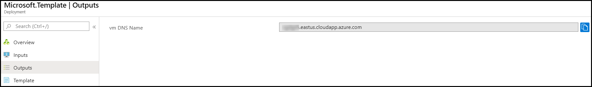
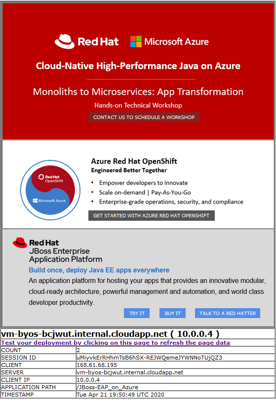

# WildFly 18 on CentOS 8 (stand-alone VM)

`Tags: WildFly 18.0.1.Final, Red Hat, CentOS, Java, Java EE, Jakarta EE, Azure, Azure VM`

<!-- TOC -->

1. [Solution Overview](#solution-overview)
2. [Template Solution Architecture](#template-solution-architecture)
3. [Licenses, Subscriptions and Costs](#licenses-subscriptions-and-costs)
4. [Prerequisites](#prerequisites)
5. [Deployment Steps](#deployment-steps)
6. [Deployment Time](#deployment-time)
7. [Validation Steps](#validation-steps)
8. [Troubleshoot](#troubleshoot)
9. [Notes](#notes)
10. [Support](#support)

<!-- /TOC -->

## Solution Overview

This template creates a standalone node of WildFly on CentOS VM of Standard_DS2_v2 size (users can select the size of the VM from the dropdown options) in your Resource Group (RG) which includes a Public DNS name, Virtual Network and Network Security Group. It is ideal for development and testing of enterprise Java applications on Azure.

WildFly is an open-source application server runtime that is exceptionally fast, flexible, lightweight and powerful. It is Jakarta EE 8 Full Platform and Web Profile compatible.  The state-of-the-art architecture built on the Modular Service Container enables services on-demand when your application requires them.

This Azure quickstart template deploys WildFly 18.0.1.Final running on CentOS 8 VM.

The technology behind WildFly is also available in Red Hat JBoss Enterprise Application Platform (EAP), a hardended enterprise subscription with Red Hat's world-class support, long multi-year maintenance cycles and exclusive content. JBoss EAP is an open-soure application server that you can download for free, for developement use. To obtain a Red Hat Subscription Management (RHSM) account for JBoss EAP, go to: www.redhat.com. Red Hat Subscription Management (RHSM) is a customer-driven, end-to-end solution that provides tools for subscription status and management and integrates with Red Hat's system management tools.

## Template Solution Architecture 

This template creates all the Azure compute resources to run WildFly 18.0.1.Final on top of CentOS 8.0 VM. The following resources are created by this template:

- CentOS 8 VM 
- Public IP 
- Virtual Network 
- Network Security Group 
- WildFly 18.0.1.Final
- Sample Java application named JBoss-EAP on Azure deployed on WildFly

Following is the Architecture:

To learn more about the WildFly 18.0.0.Final, visit:
https://docs.wildfly.org/18/

## Licenses, Subscriptions and Costs 

This template uses an Azure CentOS 8 image which is a Pay-as-you-go (PAYG) VM image and does not require the user to license. The VM will be licensed automatically after the instance is launched for the first time and user will be charged hourly in addition to Microsoft's Linux VM rates.  Click [here](https://azure.microsoft.com/en-us/pricing/details/virtual-machines/linux/#linux) for pricing details. WildFly is free to download and use and does not require a Red Hat Subscription or any License, for more details click [here](https://www.wildfly.org/).

## Prerequisites 

1. Azure Subscription with specified payment method (CentOS-Based 8.0 is an [Azure Marketplace](https://azuremarketplace.microsoft.com/en-us/marketplace/apps/openlogic.centos?tab=Overview) product and requires a payment method to be specified in the Azure Subscription)

2. To create the VM, you will need:

    - **Admin Username** and password/ssh key data which is an SSH RSA public key for your VM.

    - **WildFly Username** and password to enable the WildFly Admin Console and Deployment method.

## Deployment Steps  

Build your environment with WildFly 18.0.1.Final on top of CentOS 8.0 on Azure in a few simple steps:  
1. Launch the template by clicking on the **Deploy to Azure** button.  
2. Complete the following parameter values.Then accept the terms and conditions before clicking on the **Purchase** button.

    - **Subscription** - Choose the appropriate subscription where you would like to deploy.

    - **Resource Group** - Create a new Resource Group or you can select an existing one.

    - **Location** - Choose the appropriate location for your deployment.

    - **Admin Username** - User account name for logging into your CentOS VM.

    - **Authentication Type** - Type of authentication to use on the Virtual Machine.

    - **Admin Password or SSH Key** - User account password/ssh key data which is an SSH RSA public key for logging into your CentOS VM.

    - **WildFly Username** - Username for WildFly Console Manager.

    - **WildFly Password** - User account password for WildFly Console Manager.

    - **VM Size** - Choose the appropriate size of the VM from the dropdown options.

    - Leave the rest of the parameter values (artifacts and location) as is and proceed to purchase.

## Deployment Time 

The deployment takes less than 10 minutes to complete.

## Validation Steps

- Once the deployment is successful, go to the outputs section of the deployment to obtain the VM DNS name, App URL and the Admin Console URL:

  

- Paste the App URL that you copied from the output page in a browser to view the JBoss-EAP on Azure web page.

  

- Paste the Admin Console URL that you copied from the output page in a browser to access the WildFly Admin Console and enter the Wildfly Username and password to login.

  

## Troubleshoot

This section is to give you a idea on troubleshooting the issues that might face when you deploy this template. If the parameter criteria are not fulfilled(like the Admin Password criteria) or if any parameter that are mandatory are not filled in the parameters section then the deployment will not start. Also make sure that you accept the terms and condition mentioned before you click on Purchase. Once the deployment starts you can clearly see the resources getting deployed on the deployment page and if any deployment fails you can see which of the resources failed and check the deployment failure message for more details. If your deployment fails due to the script extension, you can see that the VM is already deployed so please login to the VM to check the logs for more troubleshooting. The logs are stored in the file wildfly.install.log in path /var/lib/waagent/custom-script/download/0. This log file give you a clear message on why the script failed and exited. So you can use this log file to detect errors and troubleshoot them. Please run the following commands to check the logs once you login to the VM.

- Switch to Root user to avoid permission issues

`sudo su -`

- Enter you VM admin Password if prompted. It might prompt you for password only if you selected the Authentication Type as Password.

- Move to the directory where the logs are stored

`cd /var/lib/waagent/custom-script/download/0`

- View the logs in wildfly.install.log

`more wildfly.install.log`

## Notes

If you're interested in Red Hat JBoss EAP Azure Quickstart templates, you can find it here:

*  <a href="https://github.com/SpektraSystems/redhat-mw-cloud-quickstart/tree/master/jboss-eap-standalone-rhel7" target="_blank"> JBoss EAP 7.2 on RHEL 7.7 (stand-alone VM)</a> - Standalone JBoss EAP 7.2 with a sample web app on a RHEL 7.7 Azure VM.

*  <a href="https://github.com/SpektraSystems/redhat-mw-cloud-quickstart/tree/master/jboss-eap-standalone-rhel8" target="_blank"> JBoss EAP 7.2 on RHEL 8.0 (stand-alone VM)</a> - Standalone JBoss EAP 7.2 with a sample web app on a RHEL 8.0 Azure VM.

*  <a href="https://github.com/SpektraSystems/redhat-mw-cloud-quickstart/tree/master/jboss7.3-eap-standalone-rhel8" target="_blank"> JBoss EAP 7.3 on RHEL 8.0 (stand-alone VM)</a> - Standalone JBoss EAP 7.3 with a sample web app on a RHEL 8.0 Azure VM.

## Support 

For any support related questions, issues or customization requirements, please contact info@spektrasystems.com
